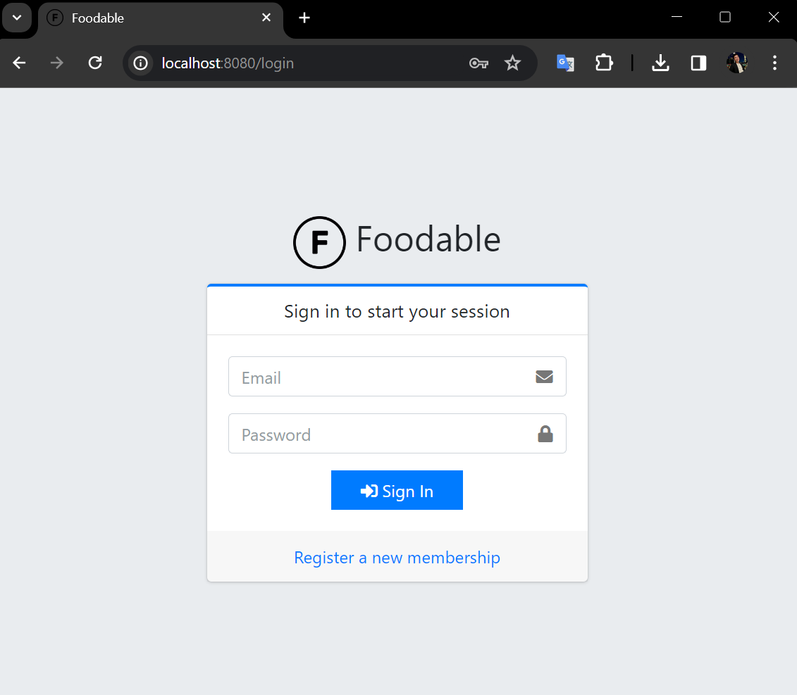

# What is Foodable
A web application which can manage your favorite restaurants, food shops and cafe.

# Enviroment
- PHP8.1
- Laravel9
- MySQL8
- Apache2.4

# How to build
## Prepare for building the database
1. Copy the .env file
```bash
cp .env.sample .env
```
2. Set user & password
## Build the docker container
*If the make commands below do not work, please run related commands in MAKEFILE.
1. Build containers
```bash
make init
```
2. Create databases
```bash
make database
```
3. Execute migrations
```bash
make migrate
```
4. Execute migrations to the database for auto testing (if you need)
```bash
docker compose exec app php artisan migrate --database=testing
```
5. Open the Login screen
http://localhost:8080/login

